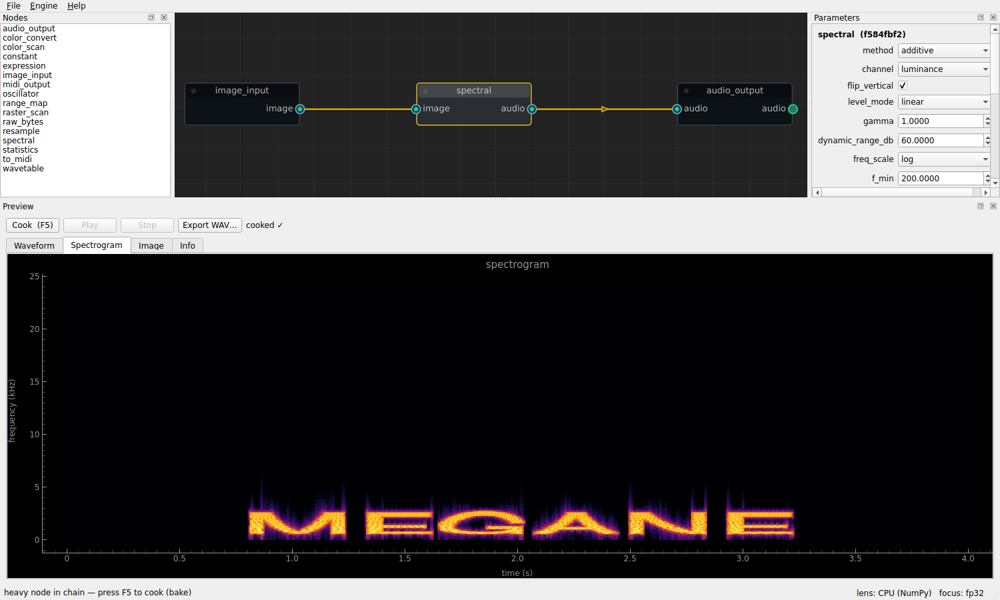
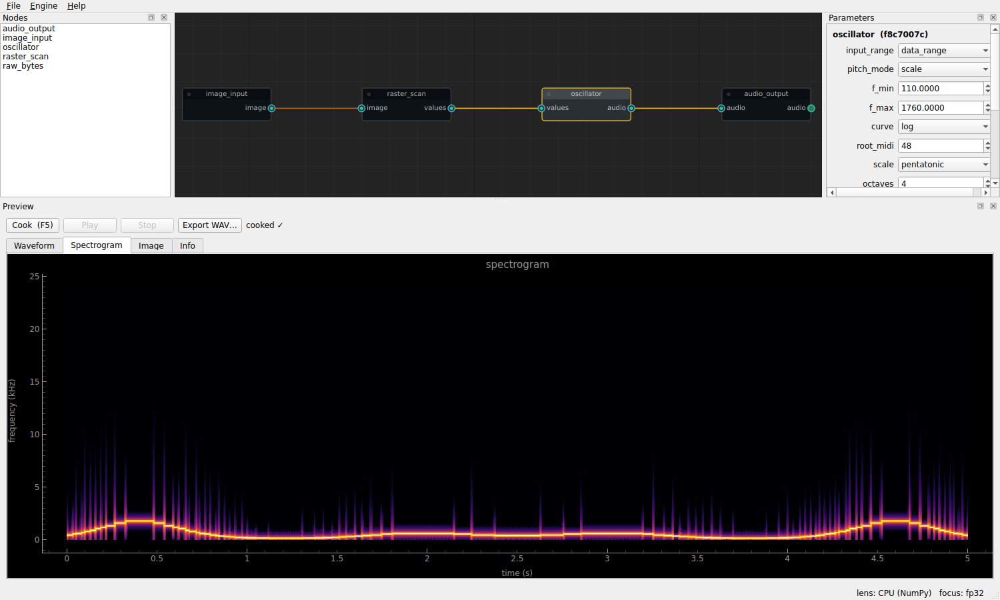

# Megane 眼鏡

**Megane** is a standalone tool that **faithfully translates image data into audio
data**. It treats an image as something to be *perceived as sound* — a lens for
sound/image experimentation rather than a music-making aid. The goal is to
explore the space of image→sound mappings; outputs are driven only by the image
and the functions you choose, with no aesthetic "sweetening."

Megane is the first of a planned family of conceptual "tools" in the **Idolmancy**
field. It is built around a **node graph**: function nodes emit generic numeric
("Channel") data, and translator nodes turn that into audio, MIDI, and more.

> **Status: v1.0 — initial development complete.** All six planned phases are
> implemented: the headless engine + CLI, the node-graph GUI, the analysis/
> synthesis/translation toolbox (raster & color scanning, wavetable, harmonic
> and spectral resynthesis, statistics, gradient, metadata, MIDI), stereo and
> multi-part composition (split/mix/pan), presets, example templates, and
> Windows packaging. 24 node types; 90 passing tests. See
> [`docs/SPEC.md`](docs/SPEC.md) for the full specification and history.


*The word in the image is the sound: a text image synthesized by the `spectral`
node, read back in the preview's spectrogram.*


*A 512×128 sine-contour image scanned column-by-column into a pentatonic
melody — the image's contour is visible as the pitch line in the spectrogram.*

## Install

Requires Python ≥ 3.10.

```bash
pip install -e .            # core engine only (numpy, Pillow)
pip install -e ".[gui,audio]"   # + node-graph GUI + better audio export/preview
# GPU (optional): install the CuPy build matching your CUDA toolkit, e.g.
#   pip install cupy-cuda12x
```

Or just `pip install -r requirements.txt`.

## The GUI

```bash
megane gui                 # or: python -m megane.gui
megane gui my.megane       # open a saved project
```

- **Nodes** panel (left): double-click a type to add it; drag ports to wire.
  Illegal connections (mismatched data types) are rejected automatically.
- **Parameters** (right): every node parameter, fully editable; `…` buttons
  browse for files/directories.
- **Preview** (bottom): Cook (`F5`), waveform + spectrogram + image + info
  views, play through speakers, export WAV.
- **Auto-cook** re-renders ~0.3 s after a change when every node in the chain
  is realtime-capable; heavy chains ask for a manual Cook ("bake").
- **Engine menu**: float precision (fp16/32/64), GPU toggle (when CuPy is
  installed), output directory.
- Projects save the graph, parameters, settings, node positions, and source
  image hashes (so you're warned if a referenced image changed on disk).

Known v1 limitations: copy/paste and undo of node *deletion* restore structure
but reset that node's parameters to defaults; parameter edits are not undoable.

## Quick start (CLI)

```bash
# 1. Generate a synthetic test image and sonify it (writes output/demo.wav):
python -m megane demo

# 2. Sonify your own image — one value per column, mapped to a pentatonic scale:
python -m megane quick-scan path/to/image.png -o out.wav \
    --axis column --channel luminance --pitch-mode scale --scale pentatonic

# 3. Reinterpret any file's raw bytes as audio (data-bending):
python -m megane raw path/to/anyfile -o raw.wav --dtype uint8 --sr 8000

# 4. Save a pipeline as a project and re-render it later:
python -m megane quick-scan image.png -o out.wav --save my.megane
python -m megane render my.megane

# Engine info / available nodes:
python -m megane info
```

Add `--play` to preview through your speakers (needs `sounddevice`), `--gpu` to
request the CUDA backend, and `--precision {fp16,fp32,fp64}` to trade accuracy
for speed.

## How it works

```
image_input ─▶ raster_scan ─▶ oscillator ─▶ audio_output
                (Image→data)   (data→audio)   (WAV + preview)

# color pipeline: hue→pitch, brightness→dynamics, saturation→timbre
image_input ─▶ color_scan ─┬─▶ (c1) oscillator.values ─▶ audio_output
                           ├─▶ (c3) oscillator.amp
                           └─▶ (c2) oscillator.shape

# math data → MIDI
… ─▶ color_scan ─▶ to_midi ─▶ midi_output   (.mid)

# the image IS the spectrogram (heavy: bake with F5; GPU-accelerated)
image_input ─▶ spectral ─▶ audio_output

raw_bytes ───────────────────────────────▶ audio_output
```

**Node families:** sources (`image_input`, `raw_bytes`, `constant`),
image ops (`color_convert`, `split`), analysis (`raster_scan`, `color_scan`,
`statistics`, `gradient`, `metadata`), synthesis (`oscillator`, `wavetable`,
`spectral`, `harmonic`), translation (`to_midi`), control/math (`expression`,
`range_map`, `resample`), stereo/mix (`pan`, `stereo_merge`, `stereo_width`,
`mix`), and sinks (`audio_output`, `midi_output`). New nodes appear in the
GUI automatically.

Ready-made starting points live in [`examples/`](examples/) (open, set the
image path, press F5), and common node configurations are available as
presets in the parameter panel — your own presets save to
`~/.megane/presets.json`.

Data flows between nodes as typed ports (modeled on TouchDesigner):

| Type | Carries |
|---|---|
| **Image** | a 2-D raster |
| **Channel** | numeric stream(s) + sample rate — control data *and* audio |
| **MIDIData** | note events *(planned)* |
| **Table** | statistics / metadata *(planned)* |

All heavy math runs through a backend abstraction (NumPy now, CuPy/CUDA later),
and evaluation is on-demand ("cook"): light nodes recompute fast for preview;
heavy nodes bake to a file.

## Project layout

```
megane/core    data types, backend, node + graph engine, project save/load
megane/dsp     pitch mapping, synthesis, spectral analysis
megane/io      image decode, audio export/playback
megane/nodes   the node library
megane/gui     node-graph interface (PySide6 + NodeGraphQt + pyqtgraph)
megane/cli.py  command-line interface
tests/         pytest suite (GUI tests auto-skip without the gui extra)
docs/SPEC.md   full specification & development plan
```

## Development

```bash
pip install -e ".[dev]"
python -m pytest
```

## Roadmap

1. ✅ Engine vertical slice
2. ✅ Node-graph GUI
3. ✅ Color / statistics / MIDI toolbox + per-method pitch
4. ✅ Spectral (image→spectrogram→audio) + GPU readiness
5. ✅ Stereo, harmonics, vectors, metadata, image splitting
6. ✅ Presets, example templates, packaging — **v1.0**

GPU: `pip install cupy-cuda12x`, then *Engine → Use GPU* (GUI) or `--gpu`
(CLI). Benchmark your machine with `megane bench [--size 5000] --gpu`.
Windows standalone build: see [`docs/INSTALL_WINDOWS.md`](docs/INSTALL_WINDOWS.md).

Later: multi-image composition, video→audio, 3D/point clouds, audio→image, and a
companion **Mangekyo** (kaleidoscope) tool for *transformation* rather than
faithful translation. Full detail in [`docs/SPEC.md`](docs/SPEC.md).

## License

**TBD.** Not yet chosen. Since the project is intended to be non-commercial, a
permissive license like MIT (which allows commercial reuse) may not fit — a
non-commercial or "all rights reserved" license may be more appropriate.
